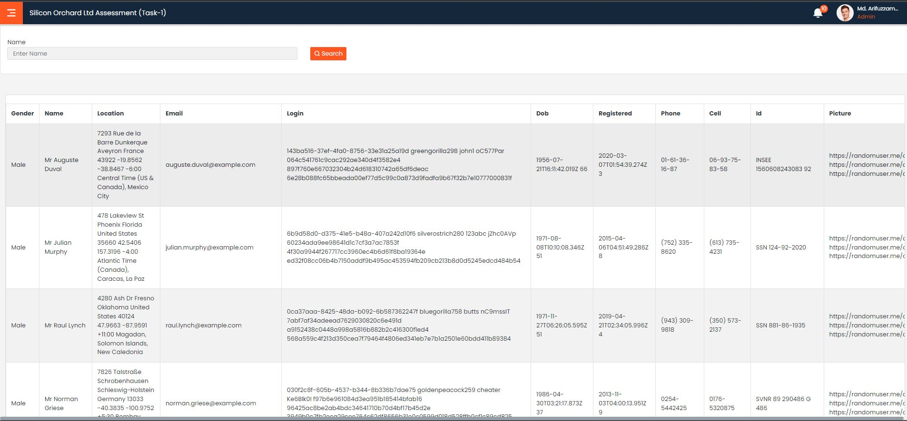
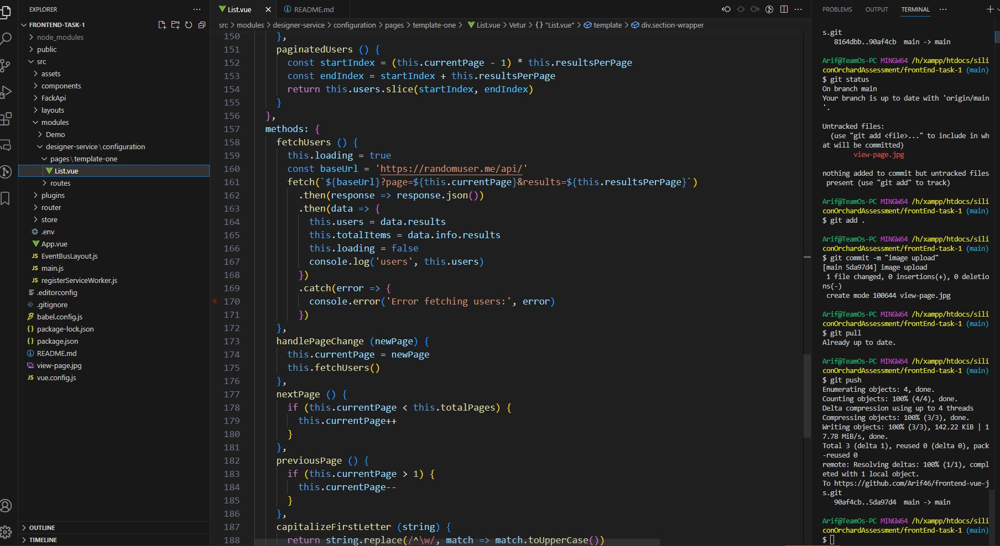

## Silicon orchard ltd - Assignment (Frontend-task-1)

## Author - Md Arifuzzaman

## email - arifuzzamanarif42@gmail.com

## Project setup
## Git clone: git clone https://github.com/Arif46/frontend-vue-js.git
```
npm install
```

### Compiles and hot-reloads for development
```
npm run serve
```

### Compiles and minifies for production
```
npm run build
```

### Lints and fixes files
```
npm run lint
```

### Customize configuration
See [Configuration Reference](https://cli.vuejs.org/config/).

## assingment view

## file structure image
